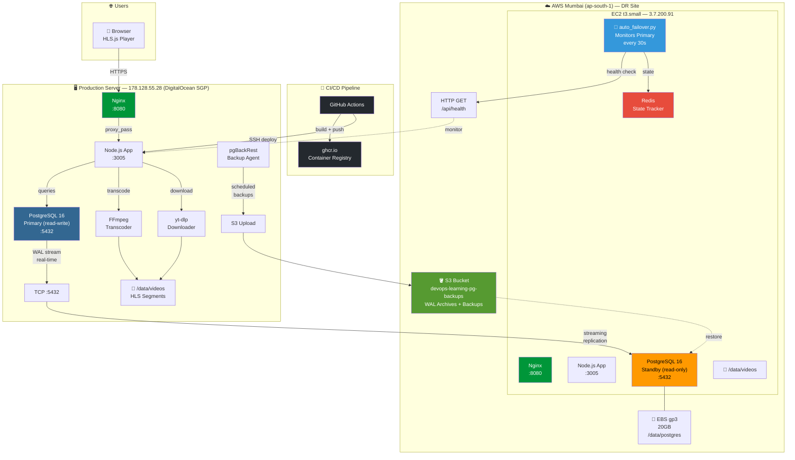
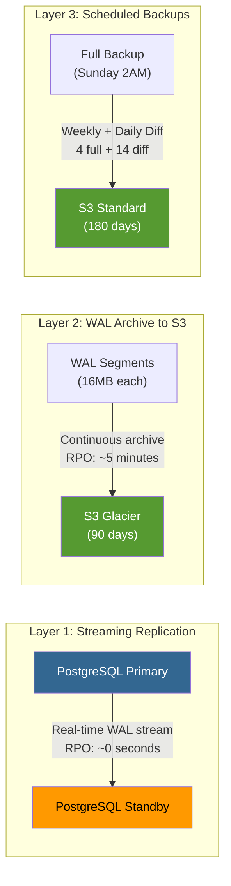
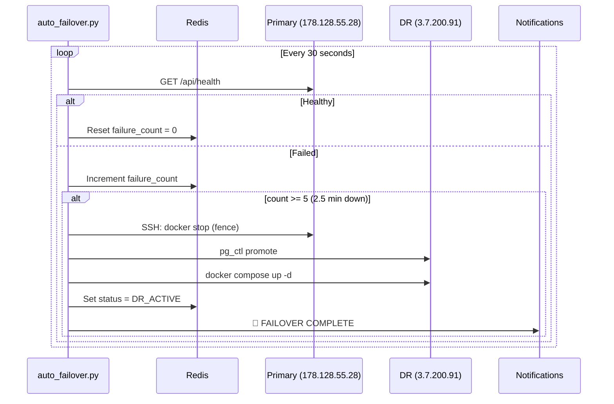
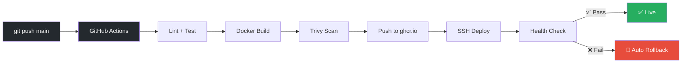

# DevOps Learning Web — Video Streaming Platform

A self-hosted video streaming platform for personal DevOps learning. Download YouTube videos, upload them to your Linux server, and stream them with adaptive quality through a modern web interface.

## Architecture

### Full System Architecture



### Disaster Recovery — 3 Layer Protection



### Automatic Failover Flow



### CI/CD Pipeline



## Features

- 📺 **HLS Adaptive Streaming** — 480p / 720p / 1080p quality switching
- 🎬 **Video Player** — Keyboard shortcuts, speed control, quality selector
- 📥 **YouTube Download** — Paste a URL, auto-download via yt-dlp
- 📤 **File Upload** — Drag & drop with progress tracking
- 🔍 **Search & Filter** — By title, category, tags
- 🐳 **Docker** — One-command deployment
- 🔄 **CI/CD** — GitHub Actions with auto-deploy & rollback
- 🐘 **PostgreSQL** — Production-grade database with connection pooling
- 🛡️ **Disaster Recovery** — Automatic failover with 3-layer data protection
- 📊 **Monitoring** — Health checks, replication lag, backup status

## Quick Start

### Local Development

```bash
# Clone
git clone https://github.com/ITNeutronsBlog/devops-learning-web.git
cd devops-learning-web

# Install backend dependencies
cd backend && npm install && cd ..

# Run locally (Node.js)
cd backend && npm run dev
# Open http://localhost:3000
```

### Docker (Recommended)

```bash
docker compose up -d
# Open http://localhost:8080
```

### Linux Server (Production)

```bash
# Run the setup script on your Linux server
curl -fsSL https://raw.githubusercontent.com/ITNeutronsBlog/devops-learning-web/main/scripts/setup-server.sh | sudo bash
```

## Usage

### Upload a Video
1. Navigate to **Upload** in the sidebar
2. Drag & drop a video file or click to browse
3. Fill in title, category, and tags
4. Click Upload — transcoding starts automatically

### Download from YouTube
1. Navigate to **Download** in the sidebar
2. Paste a YouTube URL
3. Set category and tags
4. Click Download — the server downloads and transcodes it

### CLI Download
```bash
./scripts/download-video.sh "https://youtube.com/watch?v=abc123" kubernetes
```

## DR Operations

### Scripts

| Script | Purpose | Trigger |
|--------|---------|---------|
| `auto_failover.py` | Monitor primary, auto failover | Automatic (daemon) |
| `auto_failback.py` | Restore primary from DR | Manual |
| `dr-failover.sh` | Manual failover (bash) | Manual |
| `dr-failback.sh` | Manual failback (bash) | Manual |
| `dr-drill.sh` | Quarterly DR test | Manual |
| `dr-monitor.sh` | Health check script | Cron (5 min) |

### Quick Commands

```bash
# Check auto-failover status
python3 scripts/auto_failover.py --status

# Run DR drill
bash scripts/dr-drill.sh

# Force failover
python3 scripts/auto_failover.py --failover-now

# Failback to primary
python3 scripts/auto_failback.py --preflight
python3 scripts/auto_failback.py
```

## API Endpoints

| Method | Endpoint | Description |
|--------|----------|-------------|
| `GET` | `/api/health` | Server health & stats |
| `GET` | `/api/videos` | List videos (filter/search/sort) |
| `GET` | `/api/videos/:id` | Video details |
| `POST` | `/api/videos/upload` | Upload video (multipart) |
| `POST` | `/api/videos/download` | Download from YouTube URL |
| `PUT` | `/api/videos/:id` | Update metadata |
| `DELETE` | `/api/videos/:id` | Delete video & files |
| `POST` | `/api/videos/:id/transcode` | Re-trigger transcoding |
| `GET` | `/api/videos/:id/status` | Transcoding progress |
| `GET` | `/api/categories` | List categories |

## Tech Stack

| Component | Technology |
|-----------|-----------|
| Frontend | HTML / CSS / JS + HLS.js |
| Backend | Node.js 20 + Express |
| Database | PostgreSQL 16 (pg.Pool) |
| Transcode | FFmpeg |
| Download | yt-dlp |
| Proxy | Nginx |
| Container | Docker + Docker Compose |
| CI/CD | GitHub Actions |
| DR | AWS EC2 + S3 + Streaming Replication |
| Monitoring | auto_failover.py + Redis |
| IaC | Terraform (AWS Mumbai) |
| Backup | pgBackRest → S3 |

## Infrastructure

| Resource | Location | Purpose |
|----------|----------|---------|
| Production Server | DigitalOcean SGP (178.128.55.28) | Main app + PostgreSQL primary |
| DR Server | AWS Mumbai (3.7.200.91) | PostgreSQL standby + failover |
| S3 Bucket | AWS ap-south-1 | WAL archives + scheduled backups |
| EBS Volume | AWS ap-south-1 | 20GB gp3 for DR PostgreSQL data |
| Container Registry | ghcr.io | Docker image storage |

## CI/CD

Push to `main` triggers:
1. **Lint & Test** → ESLint + Jest
2. **Docker Build** → Build, push to `ghcr.io`, Trivy scan
3. **Deploy** → SSH to server, pull image, health check, auto-rollback

See `.github/workflows/` for full pipeline configuration.

## License

Private — Personal use only.
