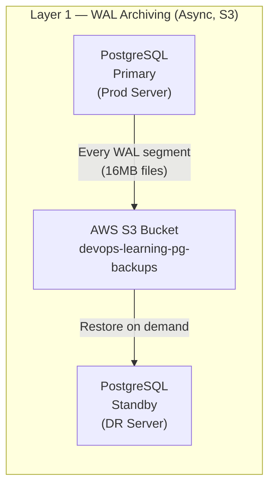
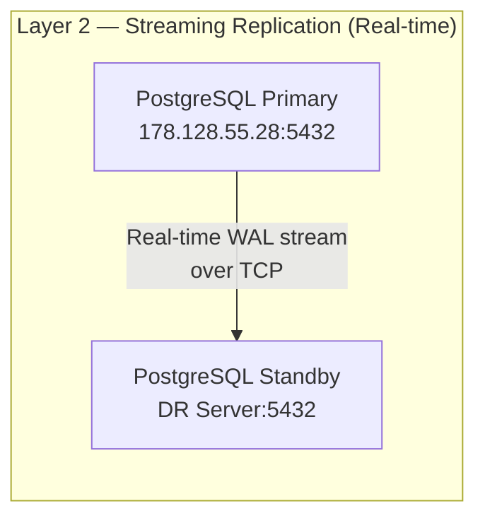
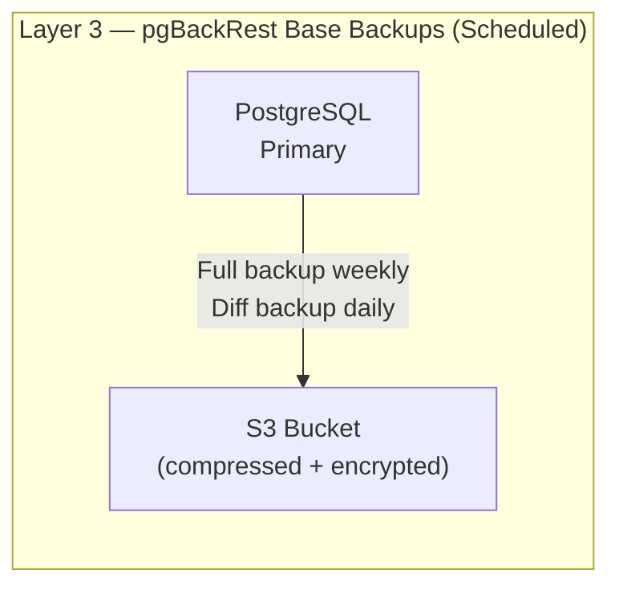
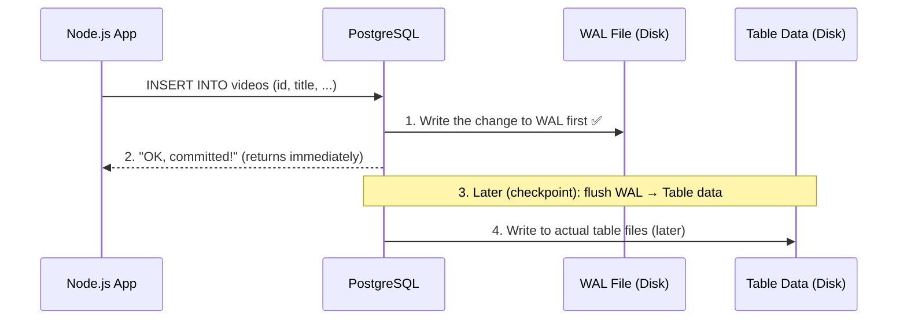
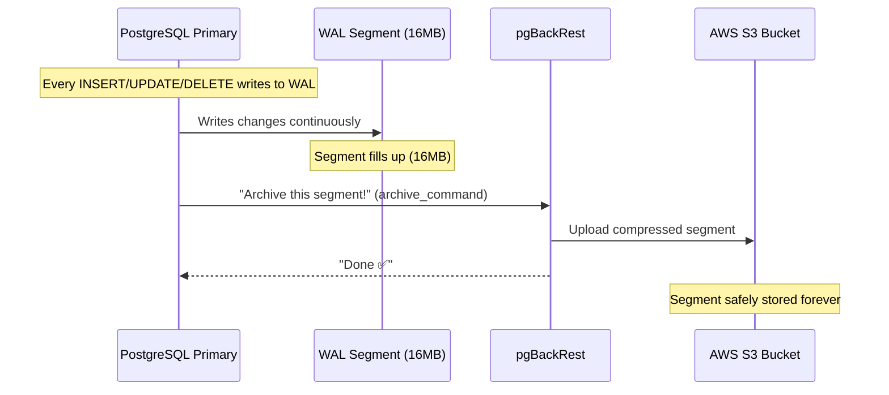
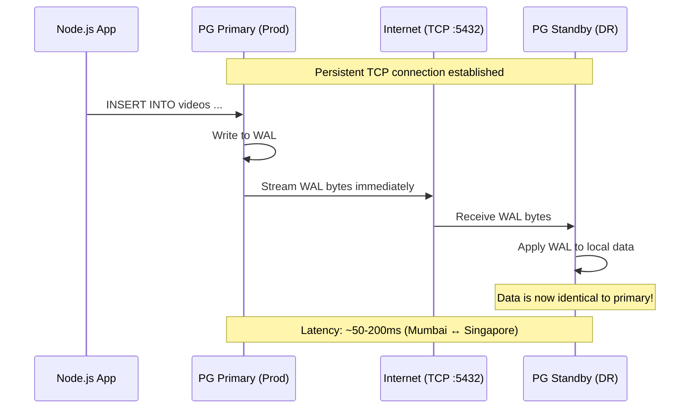
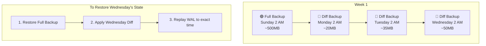
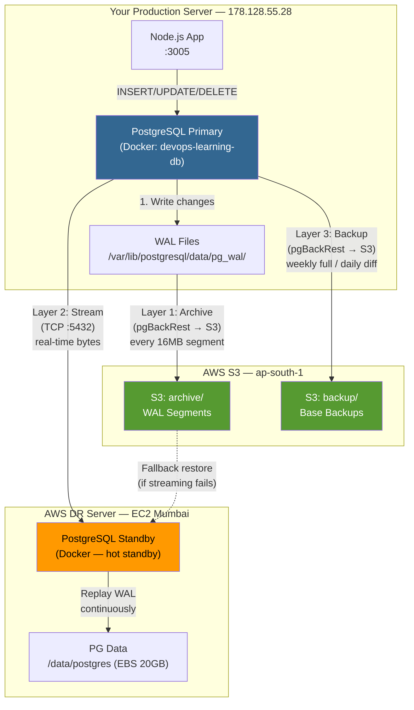
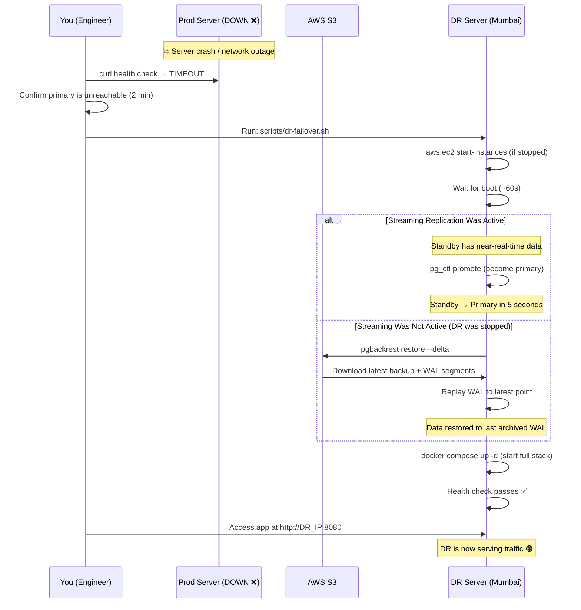

# PostgreSQL Replication — Full Deep-Dive Walkthrough

## How Does Data Get From Production → DR Server?

Your setup uses a **3-layer replication strategy**. Each layer provides a different level of protection:







| Layer | What It Does | RPO | When It Runs |
|-------|-------------|-----|-------------|
| **WAL Archiving** | Ships every 16MB WAL segment to S3 | ~5 min | Continuous (automatic) |
| **Streaming Replication** | Real-time byte-level replication | ~0 sec | Continuous (live TCP connection) |
| **pgBackRest Backups** | Full/differential snapshots to S3 | Point-in-time | Scheduled (cron) |

---

## What is WAL? (The Foundation of Everything)

**WAL = Write-Ahead Log**. This is the single most important concept to understand.

### How PostgreSQL Writes Data

PostgreSQL **never writes data directly to tables**. Instead:



**Key insight**: The WAL file contains **every single change** ever made to the database in exact order. If you have the WAL, you can reconstruct the database to any point in time.

### WAL Segments

WAL is written as a series of **16MB segment files**:

```
/var/lib/postgresql/data/pg_wal/
├── 000000010000000000000001    (16MB)
├── 000000010000000000000002    (16MB)
├── 000000010000000000000003    (16MB)  ← current, being written
└── ...
```

When a segment is full (16MB), PostgreSQL:
1. Starts a new segment
2. **Archives the old one** (this is where replication begins!)

---

## Layer 1: WAL Archiving to S3 (Asynchronous)

### How It Works



### Configuration That Makes This Happen

In your `postgres/postgresql.conf`:

```ini
# Tell PostgreSQL: "You are a replication primary"
wal_level = replica

# Tell PostgreSQL: "Archive every completed WAL segment"
archive_mode = on

# Tell PostgreSQL: "Use this command to archive"
# %p = path to the WAL segment file
archive_command = 'pgbackrest --stanza=main archive-push %p'
```

In `/etc/pgbackrest/pgbackrest.conf` (on primary server):

```ini
[global]
repo1-type=s3
repo1-s3-bucket=devops-learning-pg-backups
repo1-s3-region=ap-south-1
repo1-s3-endpoint=s3.amazonaws.com
repo1-retention-full=4          # Keep 4 full backups
repo1-retention-diff=14         # Keep 14 differential backups

[main]
pg1-path=/var/lib/postgresql/data
pg1-port=5432
pg1-user=devops
```

### What Happens Step by Step

1. Your app does: `INSERT INTO videos (id, title, ...) VALUES (...)`
2. PostgreSQL writes this change to the current WAL segment
3. WAL segment fills up to 16MB
4. PostgreSQL runs: `pgbackrest --stanza=main archive-push /pg_wal/000000010000000000000005`
5. pgBackRest **compresses** the segment (16MB → ~2-4MB)
6. pgBackRest **encrypts** it (AES-256)
7. pgBackRest **uploads** it to `s3://devops-learning-pg-backups/archive/main/...`
8. The cycle repeats with the next segment

### RPO of WAL Archiving

**RPO ≈ the time it takes to fill a 16MB WAL segment**

- High write activity: segments fill in seconds → RPO ≈ seconds
- Low write activity (your case): segments may take minutes → RPO ≈ 5-15 minutes
- You can force archiving with: `SELECT pg_switch_wal();` → RPO = 0

---

## Layer 2: Streaming Replication (Real-Time)

This is the **fastest** replication method. The DR server maintains a **live TCP connection** to the primary and receives changes in real-time.

### How It Works



### Setup on Primary Server (Your Prod Server: 178.128.55.28)

#### 1. Create a Replication User

```bash
# SSH into your production server
docker exec -it devops-learning-db psql -U devops -d devops_learning

# Inside psql:
CREATE ROLE replicator WITH REPLICATION LOGIN PASSWORD 'your_replication_password';
```

#### 2. Allow Replication Connections

Create a file `postgres/pg_hba.conf` or add this line:

```
# Allow DR server to connect for replication
# TYPE    DATABASE        USER          ADDRESS                    METHOD
host      replication     replicator    DR_SERVER_ELASTIC_IP/32    scram-sha-256
```

#### 3. Verify PostgreSQL Config

```ini
# Already in your postgresql.conf:
wal_level = replica           # ✅ Required
max_wal_senders = 3           # ✅ Allow up to 3 replication connections
max_replication_slots = 3     # ✅ Prevent WAL cleanup before DR has it
wal_keep_size = 256MB         # ✅ Keep 256MB of WAL in case DR falls behind
```

### Setup on DR Server (AWS EC2)

#### 1. Create a Replication Slot on Primary

```bash
# On primary server — prevents WAL from being deleted before DR reads it
docker exec -it devops-learning-db psql -U devops -d devops_learning -c \
  "SELECT pg_create_physical_replication_slot('dr_mumbai');"
```

#### 2. Take a Base Backup (Initial Copy)

```bash
# On DR server — this copies ALL data from primary
pgbackrest --stanza=main backup --type=full

# OR use pg_basebackup directly:
pg_basebackup -h 178.128.55.28 -U replicator -D /data/postgres \
  --checkpoint=fast --slot=dr_mumbai --wal-method=stream -v
```

#### 3. Configure Standby Mode

Create `/data/postgres/standby.signal` (empty file — tells PG "you are a standby"):

```bash
touch /data/postgres/standby.signal
```

Add to `postgresql.conf` on DR server:

```ini
# Connection to primary
primary_conninfo = 'host=178.128.55.28 port=5432 user=replicator password=your_replication_password application_name=dr_mumbai'
primary_slot_name = 'dr_mumbai'

# Restore archived WAL from S3 (fallback if streaming falls behind)
restore_command = 'pgbackrest --stanza=main archive-get %f %p'

# This server is read-only
hot_standby = on
```

#### 4. Start Standby PostgreSQL

```bash
# On DR server
docker compose up -d postgres
```

### What Happens During Streaming Replication

```
PRIMARY (178.128.55.28)                    DR STANDBY (Mumbai EC2)
═══════════════════════                    ════════════════════════

1. App writes to PG                        
2. PG writes to WAL ─────────────────────► 3. Receives WAL bytes via TCP
                                           4. Writes WAL to local disk
                                           5. Replays WAL → updates tables
                                           
   Data: "Video X uploaded"  ───(~100ms)──► Data: "Video X uploaded" ✅

WAL is also archived to S3 ──────────────► Can restore from S3 if TCP drops
```

### Monitoring Replication

```bash
# On PRIMARY — check replication status
docker exec devops-learning-db psql -U devops -d devops_learning -c \
  "SELECT client_addr, state, sent_lsn, write_lsn, flush_lsn, replay_lsn,
          pg_wal_lsn_diff(sent_lsn, replay_lsn) AS lag_bytes
   FROM pg_stat_replication;"
```

**Expected output:**
```
client_addr    | state     | lag_bytes
───────────────┼───────────┼──────────
13.232.xx.xx   | streaming | 0          ← 0 means perfectly in sync!
```

---

## Layer 3: pgBackRest Base Backups (Scheduled)

WAL archiving stores individual changes, but restoring from WAL alone would mean replaying *every change since the beginning of time*. **Base backups** create a snapshot, so you only need to replay WAL since the last backup.

### Backup Types



| Type | What It Contains | Size | Frequency |
|------|-----------------|------|-----------|
| **Full** | Complete copy of entire database | ~500MB | Weekly (Sunday) |
| **Differential** | Only changes since last full | ~20-100MB | Daily (Mon-Sat) |
| **WAL** | Individual transaction logs | ~2-4MB each | Continuous |

### Backup Schedule (Cron)

```bash
# On primary server — add to crontab
0 2 * * 0  /scripts/backup.sh full    # Sunday 2 AM — full backup
0 2 * * 1-6 /scripts/backup.sh diff   # Mon-Sat 2 AM — differential
```

### What a Backup Looks Like in S3

```
s3://devops-learning-pg-backups/
├── archive/main/                        ← WAL segments
│   ├── 16-1/
│   │   ├── 000000010000000000000001.gz
│   │   ├── 000000010000000000000002.gz
│   │   └── ...
├── backup/main/                         ← Base backups
│   ├── 20260412-020000F/               ← Full backup (Sunday)
│   │   ├── backup.manifest
│   │   ├── pg_data/
│   │   └── ...
│   ├── 20260413-020000D/               ← Diff backup (Monday)
│   └── 20260414-020000D/               ← Diff backup (Tuesday)
```

---

## The Complete Data Flow (All 3 Layers Together)



### Timeline of a Single Write Operation

```
T+0ms     App: INSERT INTO videos (id, title) VALUES ('abc', 'My Video')
T+1ms     PG Primary: Write to WAL segment (in memory buffer)
T+2ms     PG Primary: fsync WAL to disk → return "COMMIT" to app
T+3ms     PG Primary: Send WAL bytes to DR via TCP stream (Layer 2)
T+100ms   PG Standby: Receives WAL bytes, writes to local WAL
T+105ms   PG Standby: Replays WAL → row appears in standby's videos table
T+???     WAL segment fills up (16MB) → pgBackRest archives to S3 (Layer 1)
T+2AM     pgBackRest runs scheduled differential backup (Layer 3)
```

---

## Failover Scenario — What Happens When Primary Dies?



### Two Failover Modes

| Mode | When | Data Loss | Recovery Time |
|------|------|-----------|---------------|
| **Hot failover** | DR was running with streaming replication | ~0 (seconds of data) | ~2 minutes |
| **Cold failover** | DR was stopped (cost saving) | Up to last archived WAL (~5-15 min) | ~10-15 minutes |

---

## Current Setup Status

Here's what's configured **right now** vs what needs manual setup:

| Component | Status | Notes |
|-----------|--------|-------|
| ✅ PostgreSQL Primary | **Running** | Docker container on prod server |
| ✅ DR EC2 Instance | **Created** | Terraform provisioned in Mumbai |
| ✅ S3 Backup Bucket | **Created** | `devops-learning-pg-backups` |
| ✅ Security Group | **Configured** | PG port 5432 open from primary IP |
| ✅ postgresql.conf | **WAL enabled** | `wal_level=replica`, `archive_mode=on` |
| ⬜ pgBackRest on Primary | **Needs setup** | Install + configure stanza |
| ⬜ Replication User | **Needs creation** | `CREATE ROLE replicator ...` |
| ⬜ pg_hba.conf | **Needs update** | Allow DR IP for replication |
| ⬜ Base Backup | **Needs running** | Initial full copy to S3/DR |
| ⬜ Streaming Connection | **Needs start** | Configure standby.signal on DR |

### Steps to Activate Replication

```bash
# ═══════════════════════════════════════════════
# STEP 1: On PRIMARY server (178.128.55.28)
# ═══════════════════════════════════════════════

# 1a. Install pgBackRest
sudo apt-get install -y pgbackrest

# 1b. Create replication user
docker exec -it devops-learning-db psql -U devops -d devops_learning -c \
  "CREATE ROLE replicator WITH REPLICATION LOGIN PASSWORD 'your_repl_password';"

# 1c. Create replication slot
docker exec -it devops-learning-db psql -U devops -d devops_learning -c \
  "SELECT pg_create_physical_replication_slot('dr_mumbai');"

# 1d. Allow DR server to connect (add to pg_hba.conf inside container)
docker exec -it devops-learning-db bash -c \
  "echo 'host replication replicator DR_ELASTIC_IP/32 scram-sha-256' >> /var/lib/postgresql/data/pg_hba.conf"

# 1e. Reload PostgreSQL config
docker exec -it devops-learning-db psql -U devops -c "SELECT pg_reload_conf();"

# 1f. Initialize pgBackRest stanza
pgbackrest --stanza=main stanza-create

# 1g. Run first full backup to S3
pgbackrest --stanza=main backup --type=full

# ═══════════════════════════════════════════════
# STEP 2: On DR server (SSH into EC2)
# ═══════════════════════════════════════════════

# 2a. Restore from S3 backup
pgbackrest --stanza=main restore

# 2b. Create standby.signal
touch /data/postgres/standby.signal

# 2c. Add replication config to postgresql.conf
cat >> /data/postgres/postgresql.conf << 'EOF'
primary_conninfo = 'host=178.128.55.28 port=5432 user=replicator password=your_repl_password application_name=dr_mumbai'
primary_slot_name = 'dr_mumbai'
restore_command = 'pgbackrest --stanza=main archive-get %f %p'
hot_standby = on
EOF

# 2d. Start PostgreSQL standby
docker compose up -d postgres

# ═══════════════════════════════════════════════
# STEP 3: Verify Replication (on PRIMARY)
# ═══════════════════════════════════════════════

docker exec devops-learning-db psql -U devops -d devops_learning -c \
  "SELECT client_addr, state, 
          pg_wal_lsn_diff(sent_lsn, replay_lsn) AS lag_bytes 
   FROM pg_stat_replication;"

# Expected: state = 'streaming', lag_bytes ≈ 0
```

---

## Summary: How Each Disaster Scenario Is Handled

| Disaster | What Survives | Recovery Method | Data Loss |
|----------|--------------|-----------------|-----------|
| App crashes | Everything | Docker restarts automatically | 0 |
| PG container crashes | Everything | Docker restarts automatically | 0 |
| Prod server disk failure | S3 backups + DR standby | Failover to DR | 0-5 min |
| Prod server destroyed | S3 backups + DR standby | Failover to DR | 0-5 min |
| AWS region failure | S3 (multi-region) + prod server | Stay on primary | 0 |
| Both servers down | S3 backups | Restore from S3 to new server | 0-15 min |
| S3 data loss | Both PG servers have full data | Continue on either server | 0 |
| Everything lost | 😱 | — | Everything |
